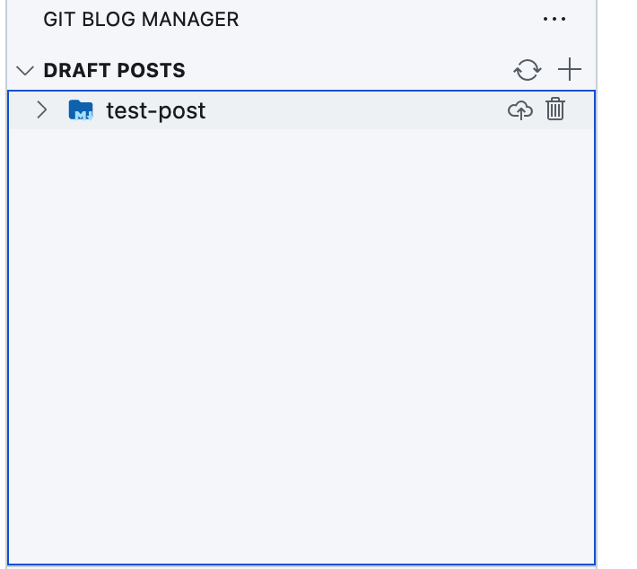
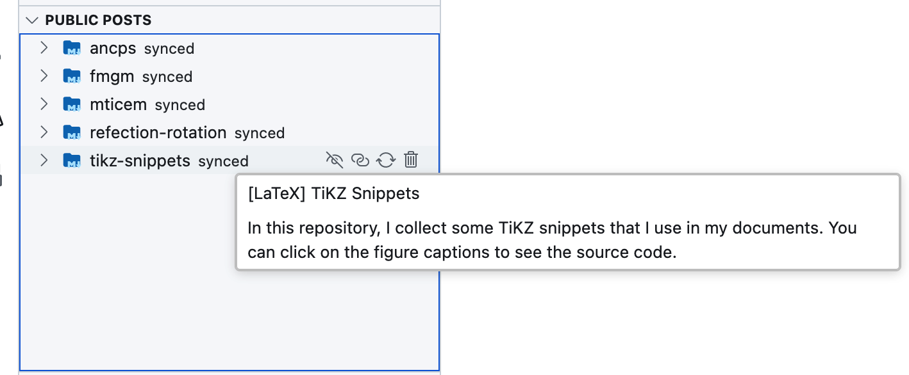
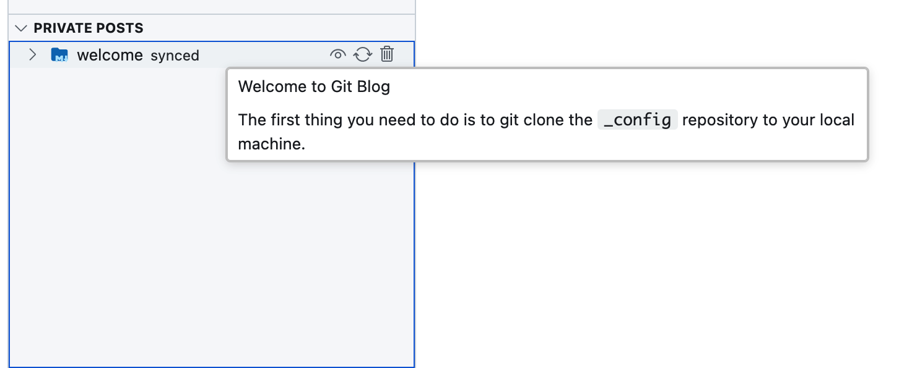

# Git Blog Manager

This vscode extension is used to manage your blog posts hosted by [git blog](https://github.com/shinyypig/git-blog).

## Features

Manage your blog posts in VSCode. You can create, edit, delete and publish your posts.

All posts are divded into three categories: `draft`, `published` and `deleted`. You can found them on the left side of the editor.

You can click the `publish` button to publish your post. The post will be moved to the `published` category.

    

You can change the states of your posts by clicking the `hide` and `unhide` button.

    

    

Notice that once you click the `delete` button, the public or private post will be moved to the `draft` category, while the draft post will be directly deleted from the system. Be careful with the draft posts deletion!

You can find the release notes [here](./CHANGELOG.md).
